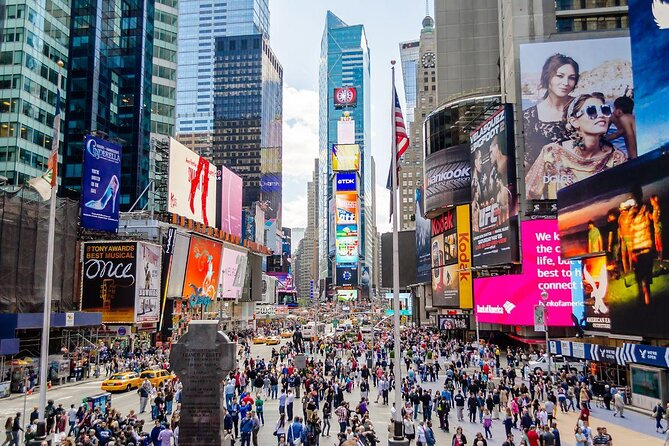
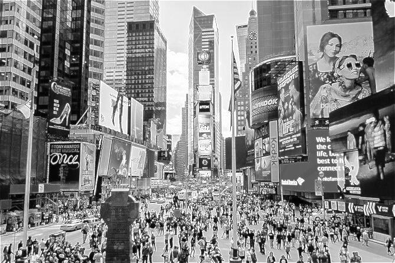
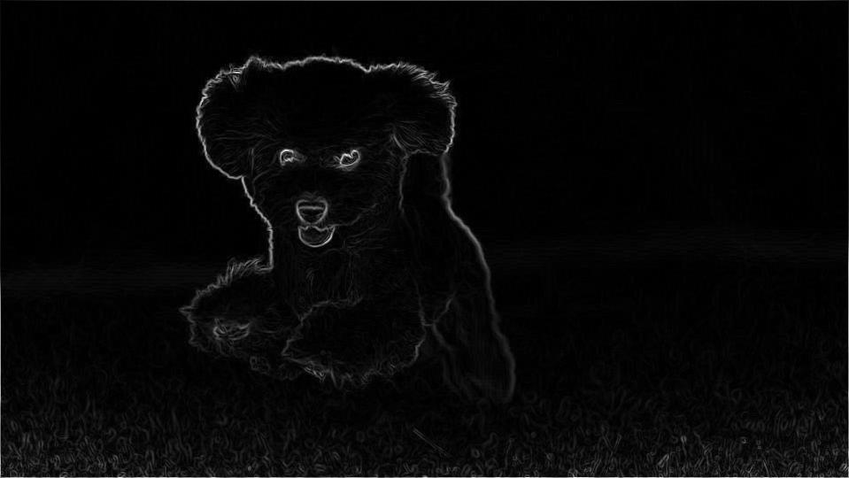

# Advanced Image Editing CLI Tool

## Introduction

Welcome to the Advanced Image Editing CLI Tool.
This tool is designed to apply custom filters and adjustments to images through a command-line interface (CLI). <br>
It showcases advanced image processing techniques using convolution and other mathematical operations.

## Features

- **Box Blur**: Applies a box blur filter to the image, creating a softened, blurry effect.
- **Edge Detection**: Utilizes the Sobel operator to highlight the edges in the image.
- **Sharpen**: Enhances image edges by making the differences between adjacent pixels more pronounced.
- **Adjustments**: Allows adjustments of brightness, contrast, and saturation.
- **Layering**: Supports applying multiple filters and adjustments in sequence.

## Getting Started

### Prerequisites

- Python 3.x
- NumPy
- Pillow (PIL)
### Installation
- The project should run without a problem, but if for some reason you are missing the required libraries <br>
you can install the required packages using the requirements.txt file by running the following command:
- `pip install -r requirements.txt`

## Usage

To use the CLI tool, run the following command:

```
python3 main edit_image --image <path-to-image> [--filter < filter-name> --filter-specific_name < filter-specific_value>] <br>
[--adjust <adjustment-name> ‹value>] [--filter < filter-name> --filter-specific_name < filter-specific_value>] <br>
...[--display] [--output <output_path>]
```

#### Example Commands

- Apply a box blur filter:
  ```
  python3 main edit_image.py --image path/to/image.png --filter blur --x 5 --y 5
  ```

- Apply edge detection:
  ```
  python3 main edit_image.py --image path/to/image.png --filter edge-detection
  ```

- Adjust brightness and apply a sharpen filter:
  ```
  python3 main edit_image.py --image path/to/image.png --adjust brightness 20 --filter sharpen --magnitude 2
  ```

## Filters

- **Box Blur**:
  - `--filter blur --x <width> --y <height>`
- **Edge Detection**:
  - `--filter edge-detection`
- **Sharpen**:
  - `--filter sharpen --magnitude <value>`
- **Grayscale (extra!)**:
  - `--filter grayscale`

## Adjustments

- **Brightness**:
  - `--adjust brightness <value>`
- **Contrast**:
  - `--adjust contrast <value>`
- **Saturation**:
  - `--adjust saturation <value>`

## Examples
left is the original image, right is the processed image:

### Saturation and Contrast

<div style="display: flex; flex-direction: row; gap: 2%;">
  <div style="text-align: center; width: 40%;">
    
    <p>Original Image</p>
  </div>
  <div style="text-align: center; width: 40%;">
    
    <p>Processed Image</p>
  </div>
</div>

### Blur and Brightness
<div style="display: flex; flex-direction: row; gap: 2%;">
  <div style="text-align: center; width: 40%;">
    
    <p>Original Image</p>
  </div>
  <div style="text-align: center; width: 40%;">
    
    <p>Processed Image</p>
  </div>
</div>

### Greyscale
<div style="display: flex; flex-direction: row; gap: 2%;">
  <div style="text-align: center; width: 40%;">
    
    <p>Original Image</p>
  </div>
  <div style="text-align: center; width: 40%;">
    
    <p>Processed Image</p>
  </div>
</div>

### Edge Detection
<div style="display: flex; flex-direction: row; gap: 2%;">
  <div style="text-align: center; width: 40%;">
    
    <p>Original Image</p>
  </div>
  <div style="text-align: center; width: 40%;">
    
    <p>Processed Image</p>
  </div>
</div>

## Author
Liel Azulay
- you can check out my github profile [here](https://github.com/liel20946)
