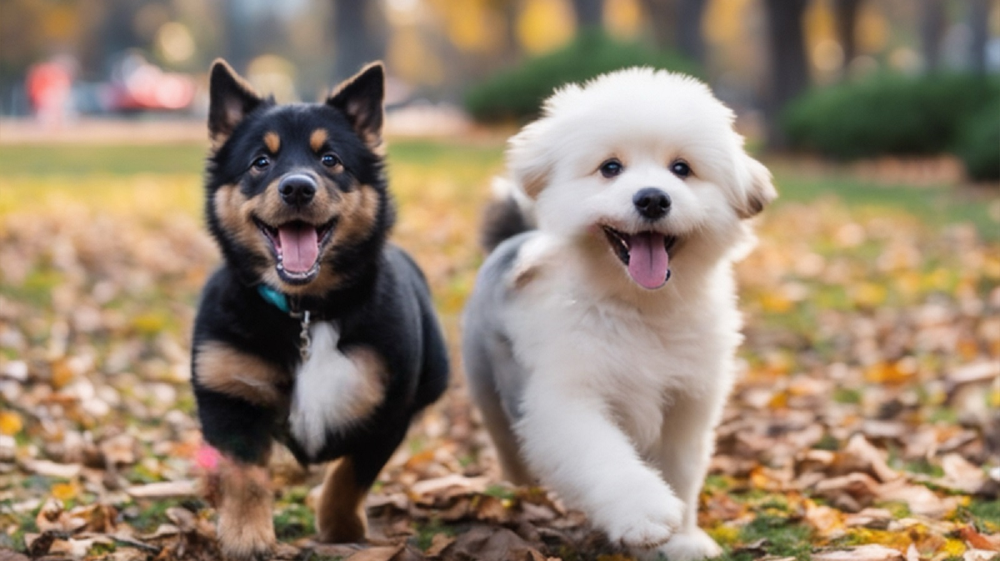
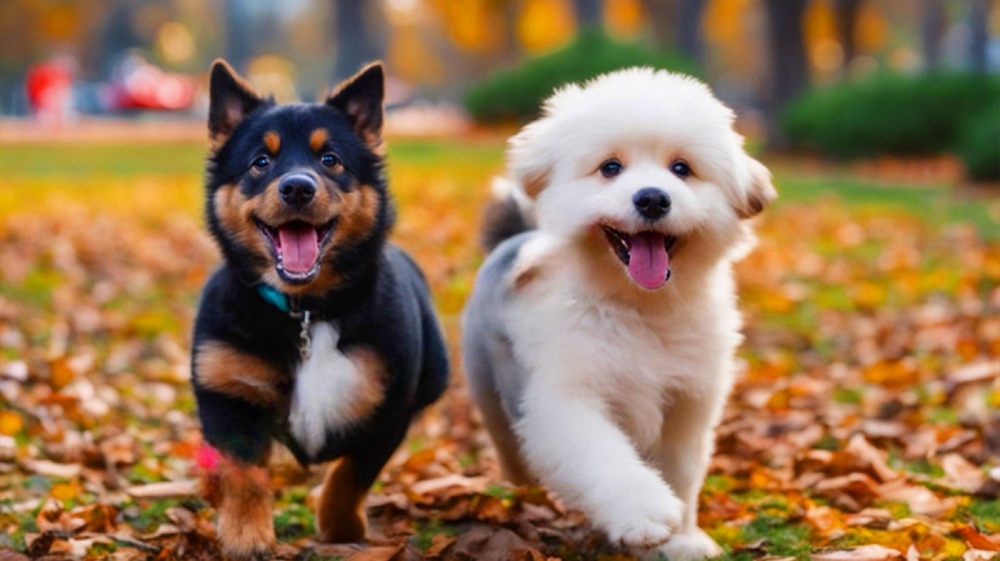
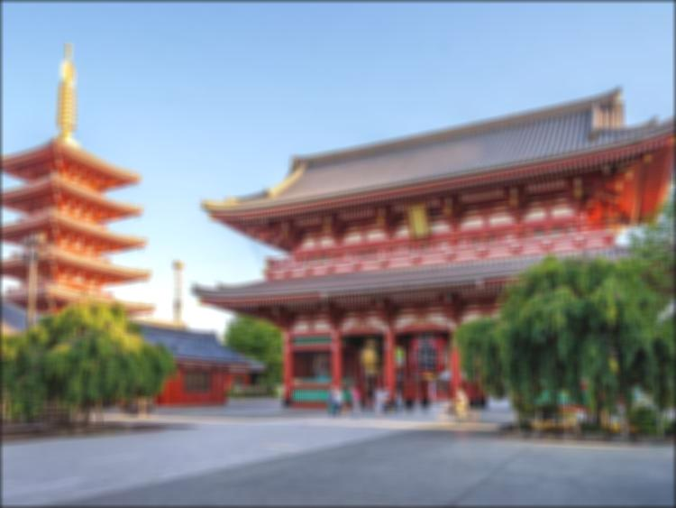

# 🌄 Advanced Image Editing CLI Tool 

## 👋 Introduction

Welcome to the Advanced Image Editing CLI Tool. This tool is designed to apply custom filters <br> 
and adjustments to images through a command-line interface (CLI). It showcases image <br>
processing techniques using convolution and other mathematical operations. The image <br>
processing algorithms are implemented from scratch.

## Features

- **Box Blur**: Applies a box blur filter to the image, creating a softened, blurry effect.
- **Edge Detection**: Utilizes the Sobel operator to highlight the edges in the image.
- **Sharpen**: Enhances image edges by making the differences between adjacent pixels more pronounced.
- **Adjustments**: Allows adjustments of brightness, contrast, and saturation.
- **Layering**: Supports applying multiple filters and adjustments in sequence.

### Supported Image Formats
jpg, jpeg, png

## 🏁 Getting Started

### Prerequisites

- Python 3.x
- NumPy
- Pillow (PIL)
### Installation
- The project should run without a problem, but if for some reason you are missing the <br>
required libraries  you can install the required packages using the requirements.txt file <br>
by running the following command:
- `pip install -r requirements.txt`

## Usage

To use the CLI tool, run the following command:

```
python3 image_editing_tool.py edit_image --image <path-to-image> 
[--filter < filter-name> --filter-specific_name < filter-specific_value>]
[--adjust <adjustment-name> --adjustment-specific_name ‹value>] 
[--filter < filter-name> --filter-specific_name < filter-specific_value>]
...[--display] [--output <output_path>]
```

#### Example Commands

- Apply a box blur filter:
  ```
  python3 image_editing_tool.py edit_image.py --image path/to/image.png --filter blur --x 5 --y 5 --display
  ```

- Apply edge detection:
  ```
  python3 image_editing_tool.py edit_image --image path/to/image.png --filter edge-detection --display
  ```

- Adjust brightness and apply a sharpen filter:
  ```
  python3 image_editing_tool.py edit_image --image path/to/image.png --adjust brightness 20 --filter sharpen --factor 2 --display
  ```

## Filters

- **Box Blur**:
  - `--filter blur --x <width> --y <height>`
- **Edge Detection**:
  - `--filter edge-detection`
- **Sharpen**:
  - `--filter sharpen --factor <value>`
  - 0 <= factor, 0 is no sharpening, 1 is normal sharpening, 2 is double sharpening, etc.
- **Grayscale (<span style="color:green;">extra!)**:
  - `--filter grayscale`

## Adjustments

- **Brightness**:
  - `--adjust brightness --factor <value>`
  - -255 <= value <= 255
- **Contrast**:
  - `--adjust contrast --factor <value>`
  - 0 <= value, 1 is no contrast, 2 is double contrast, etc.
- **Saturation**:
  - `--adjust saturation --factor <value>`
  - 0 <= value, 1 is no saturation, 2 is double saturation, etc.

## Examples
some examples of the tool in action, mostly simple filter and adjustments combinations.

### Saturation and Contrast

<div style="display: flex; flex-direction: row; gap: 2%;">
  <div style="text-align: center; width: 40%;">
    
    <p>Original Image</p>
  </div>
  <div style="text-align: center; width: 40%;">
    
    <p>Processed Image</p>
  </div>
</div>

### Blur and Brightness
<div style="display: flex; flex-direction: row; gap: 2%;">
  <div style="text-align: center; width: 40%;">
    
    <p>Original Image</p>
  </div>
  <div style="text-align: center; width: 40%;">
    
    <p>Processed Image</p>
  </div>
</div>

### Greyscale and Sharpen
<div style="display: flex; flex-direction: row; gap: 2%;">
  <div style="text-align: center; width: 40%;">
    
    <p>Original Image</p>
  </div>
  <div style="text-align: center; width: 40%;">
    
    <p>Processed Image</p>
  </div>
</div>

### Edge Detection
<div style="display: flex; flex-direction: row; gap: 2%;">
  <div style="text-align: center; width: 40%;">
    
    <p>Original Image</p>
  </div>
  <div style="text-align: center; width: 40%;">
    
    <p>Processed Image</p>
  </div>
</div>

## ✍️ Author
Liel Azulay
